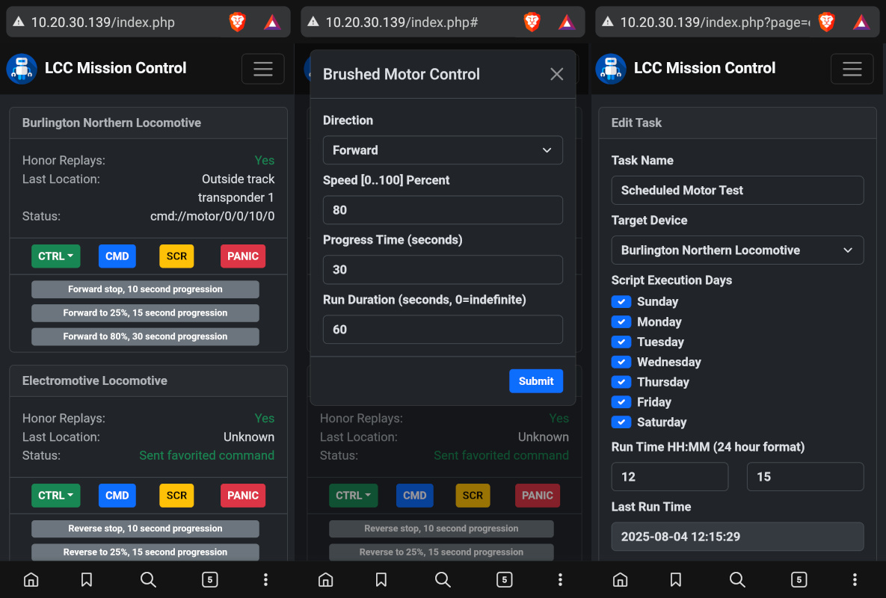

# Larry's CMD & CTRL
**aka: LCC** - Remote command and control system based on Raspberry Pi (or clone), ESP32, and low-frequency isolated WiFi. Can be used for any kind of automation that requires remote switching, motor direction and speed control, position tracking, LED lighting control, and scripting/scheduling. Also works great for model railroad control.

You may contact me directly at https://panhandleponics.com 
Subscribe to the official YouTube channel at https://www.youtube.com/@PanhandlePonics

_**NOTE:** While this can be used as an alternative to DCC and WCC in the model railroad world, that absolutely is not my specialty. This is just a viable and far more affordable alternative if you want to use it for that purpose._

_...No, I don't use AI to design and build my projects, I actually still know how to use my brain..._

**This project began on July 1, 2025 and does not yet have an official release.**

---
 
---

LCC is a client & server system where a Mission Control web app runs on a Raspberry Pi _(or clone)_ or any other Debian Linux based PC/SBC. The communications backbone between the server and client devices is a 100% isolated 802.11bg network in order to reject interference if the motor under control is nearby.

If your Mission Control server is hard-wired to your existing LAN, the LCC Slave network does not route into it. Don't use a weak admin user password on your server and it won't matter who is connected to its built-in access point, they aren't getting past it and reaching your internal network.

This system is intended for any personal application where remote control of motorized devices, remote switching, LED lighting control, and sound file playing is needed without the use of your existing WiFi infrastructure. This system will also work with no on-premises internet access.

Command delay time is negligible, even if a LCC Slave unit is reporting a -67 dBm signal level. While some people may think "Damn, WiFi, really?", my decision to use a completely isolated lower frquency/bandwidth network makes these < 100 character command exchanges complete as soon as you release the send button.

The recommended LCC Mission Control server is an [Orange Pi Zero 3 (1GB)](https://www.amazon.com/Orange-Pi-Allwinner-Bluetooth-Development/dp/B0H6HL19Q6/). You simply connect your phone or computer to its isolated WiFi network, or connect the server's ethernet port to your home router if you need local network access to it. Do not use simple port forwarding from your router into the Mission Control server, there is no login system! If you need remote access, use your router's built-in VPN capability!

### Use Cases
- RGB LED lighting automation/scripting
- Fan and actuated vent automation
- Antenna and solar panel positioning
- Conveyor and gate automation
- Irrigation system automation
- Seasonal decoration automation
- Model railroad automation

_**NOTE:** The WiFi radio in an Orange Pi Zero 3 is nothing to write home about. All slave devices should be in clear line of site of the server's antenna. If you need more range, you will need to use a high gain omnidirectional antenna. The Orange Pi Zero 3's antenna can be easily unplugged and replaced with another. A fancier Orange Pi will likely be of no value here since this is strictly an 802.11bg network, no N channel support at all._

### Motor Control
The LCC Slave module can control standard DC brushed motors using a PWM driven H bridge driver such as an L298N, or stepper motors such as a Nema 17 with a DRV8825 driver. _(You may actually use any driver you like.)_ Motor control includes direction, speed, runtime, progression time to smooth speed changes, and the number of steps _(instead of duration and progression)_ if using a stepper motor.

### Position/Location Tracking
In the case of mobile LCC Slave such as those on a model train or conveyor bot, position and location detection is handled by way of IR LED transponders. These are basically an IR remote control transmitter that repeats the same number over and over. The LCC Slave phones home to Mission Control when these are detected to report its location and may perform actions based on the location.

### Remote Limit Sensing
The LCC Slave module uses two GPIO pins for limit sensing so that the motor will stop running in the current direction if its limit switch is triggered. These are common in linear actuators and motorized ball valves. The unit will phone home to Mission Control to report this status.

### Remote Switching
The LCC Slave module can be any variety of ESP32, the switching capabilities are only limited by the number of exposed GPIO pins. The base code uses the Seeed Studio XAIO ESP32-S3 has 2 outputs for switching but can be easily expanded to 16 with an MCP23017 GPIO expansion module.

### Remote MP3 Playback
Sound files (.mp3) can be stored on an SD card and played back as needed. These are useful for greetings, sound effects, warnings, etc. This requires a WWZMDiB _(DFRobot DFPlayer)_ sound module and speaker attached. Sound files can play as a single shot or in a continuous loop.

### Remote Neopixel/WS2812 RGB LED Control
Neopixel/WS2812 addressable LEDs can be controlled at the individual fixture/LED level or the entire network can change color at the same time. Individual fixtures support color changes have an adjustable fade time from 0 to 30 seconds. If you use long chains of LEDs (up to 65535) you may also script complex animated scenes using the built-in BASIC programming language.

### Scheduling
The LCC Mission Control server can schedule scripts to run at specific times on specific days. However, in the case of single board computers such as the Raspberry Pi _(or clones)_ this requires the addition of a real time clock module to be added if the Mission Control server is isolated from the internet.

### Scripting
LCC remote control commands and scripts are completely open ended and are easy to create. Scripts can contain up to 16 sequential commands and run as a single shot instance or may run repeatedly. Scripts can also call another script at the end of its run, which means you can actually string an endless number of commands together. _(LCC Slaves have a cache that can hold 16 commands at a time.)_

### Timer Function
Each configured device has a timer that can run any number of command pairs (on and off commands). This is an on-the-fly counterpart to the Scheduling system. These are handy for setting things like lights, sprinklers, fans, etc to run for any amount of time up to 1 day (86400 seconds) and then automatically turn off.
